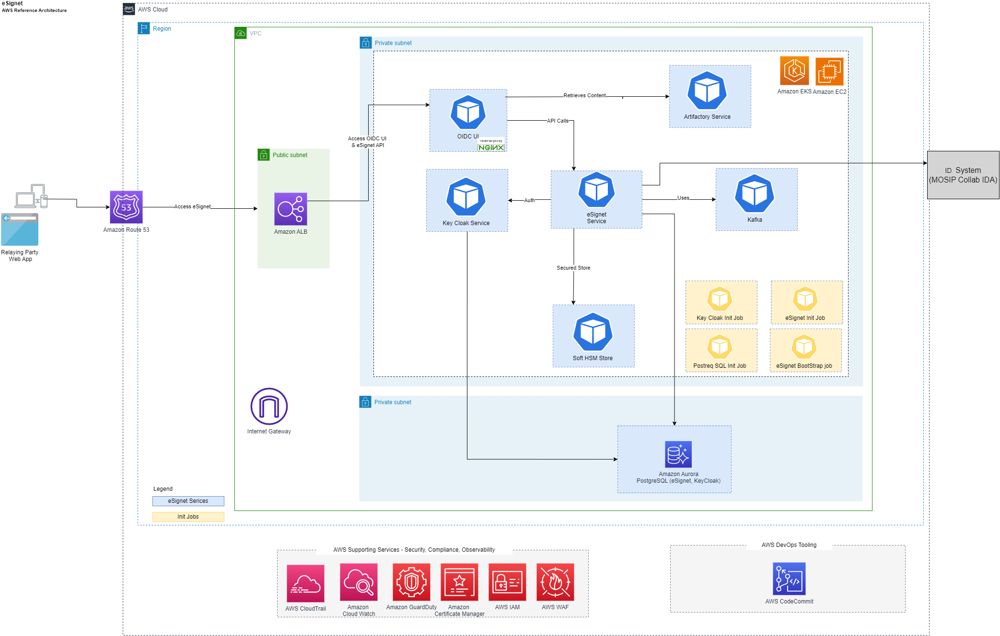

# eSignet, one-click deployment on AWS

### Description
eSignet strives to provide a user-friendly and effective method for individuals to authenticate themselves and utilize online services while also having the option to share their profile information. Moreover, eSignet supports multiple modes of identity verification to ensure inclusivity and broaden access, thereby reducing potential digital barriers.
 To learn more about eSignet, please visit [eSignet](https://docs.esignet.io/).

### Packaging overview
This packaging initiative offers a practical approach to increase the adoption, streamline deployment and management of eSignet building blocks on AWS by providing a reference architecture and one-click deployment automation scripts. It allows builders to manage AWS resource provisioning and application deployment in a programmatic and repeatable way.

This repository contains the source code and configuration for deploying eSignet stack that leverages the power of Amazon Web Services (AWS) **[Cloud Development Kit (CDK)](https://aws.amazon.com/cdk)** for infrastructure provisioning and **[Helm](https://helm.sh)** for deploying services within an Amazon Elastic Kubernetes Service (EKS) cluster.  

### eSignet Deployment
The eSignet one-click deployment packaging offers two mode of deployments on the AWS cloud, catering to different deployment scenarios.

#### Mode One: AWS CDK + Helm
This mode offers a comprehensive solution for users who prefer a one-click deployment approach to provisioning AWS infrastructure and deploying the eSignet application stack.

* [AWS CDK One Click Deployment](documentation/01-Deployment-CDK-eSignet.md)

#### Mode Two: Direct Helm Chart Invocation
An alternative deployment approach accommodates users with existing essential AWS infrastructure components like Amazon RDS Postgres and an Amazon EKS cluster. This mode enables the direct installation of the eSignet Helm chart without relying on AWS CDK scripts. Alternatively, you can combine both methods, utilizing CDK for provisioning specific services like the EKS cluster.

* [Helm Chart Deployment](documentation/02-Deployment-Helm-eSignet.md)

### eSignet reference architecture
Required AWS services to operate the core eSignet registry services:
* Amazon VPC
* Amazon RDS for PostgreSQL Serverless V2
* Amazon Elastic Kubernetes Service (Amazon EKS)
* Application Load Balancing (ALB)

