# eSignet Helm Chart Deployment

The eSignet Helm chart deployment provides an efficient way to deploy eSignet and its associated services in your existing AWS environment. This means you don’t need to use AWS CDK to provision the base services such as VPC, Amazon RDS, and Amazon EKS, among others. See the prerequisite section below for more details.

# Prerequisites

Before deploying these Helm charts, ensure you have the following prerequisites in place:

1. [Git Client](https://git-scm.com/)
2. [pgAdmin](https://www.pgadmin.org/download/pgadmin-4-windows/) (Optional: This PostgreSQL client is used to verify the DB changes. You could install it on your EC2 instance in the VPC with access to Amazon RDS Postgres server)
3. [Helm](https://helm.sh/) (installed on your local machine)
4. [Kubectl](https://kubernetes.io/docs/tasks/tools/install-kubectl/) (installed on your local machine)
5. Amazon EKS Cluster
6. Amazon RDS PostgreSQL

## Deploying eSignet services

#### 1. Initialize eSignet Helm Repository

```
helm repo add esignet-aws <ESIGNET_HELM_CHARTS_URL>
helm repo add mosip https://mosip.github.io/mosip-helm
```

#### 2. Check the Helm Repo Status:
```
helm repo list
```

```
NAME                    URL
esignet-aws             <ESIGNET_HELM_CHARTS_URL>
mosip                   https://mosip.github.io/mosip-helm

```
```
helm search repo esignet-aws
```
```
NAME                          CHART VERSION   APP VERSION  DESCRIPTION
esignet-aws/artifactory           12.0.2                        A Helm chart for MOSIP Artifactory
esignet-aws/esignet               1.4.0                         A Helm chart for MOSIP esignet module
esignet-aws/esignet-init          0.1.0           1.16.0        A Helm chart for Kubernetes
esignet-aws/esignet-preinit       0.1.0           1.16.0        A Helm chart for Kubernetes
esignet-aws/keycloak              7.1.18          16.1.1        Keycloak is a high performance Java-based identity platform
esignet-aws/oidc-ui               1.4.0                         A Helm chart for MOSIP OIDC UI module

```
```
helm search repo mosip
```
```
NAME                          CHART VERSION   APP VERSION  DESCRIPTION
mosip/kafka                 18.3.1          3.2.1         Apache Kafka is a distributed streaming platform
mosip/kafka-ui              0.4.2           v0.4.0        A Helm chart for kafka-UI
mosip/keycloak-init         12.0.1          1.2.0         A Helm chart for Kubernetes to initialize Keycloak
mosip/postgres-init         12.0.1          1.2.0         A Helm chart for Kubernetes to initialize various database
mosip/softhsm               12.0.1                        A Helm chart for MOSIP Softhsm module
```
#### 4. Install eSignet bootstrap:
eSignet bootstrap helm chart creates the database in RDS Postgres instance for both esignet and keycloak services. It also creates global configmap and db secrets in esignet kubernetes namespace which is mandatory for esignet core service.

| Property Name          | Value            | Description                                      |
|------------------------|------------------|--------------------------------------------------|
| image.envVars.HOST     | YYYYYYYY         | RDS/Data Host Address                            |
| image.envVars.USERNAME | postgres         | RDS/Data Username                                |
| image.envVars.PASSWORD | XXXXXXXX         | RDS/Data password                                |
| image.envVars.NEW_DB   | esignet_keycloak | RDS/Data Database                                |
| dbPassword             | XWXADDWAD=AWQ    | base64 encoded value of RDS/Data password        |
| domain.enabled         | true             | if this value is true, you must provide domain details in below variables, Otherwise, provide same ALB DNS name in all below variables.
| domain.name            | sandbox.demodpgs.net  | Root domain name for entire esignet applications. If you dont have custom domain, please leave it empty |
| domain.mosipApiHost    | api.sandbox.demodpgs.net  | creates config as api.sandbox.demodpgs.net |
| domain.mosipApiInternalHost | api-internal.sandbox.demodpgs.net | creates config as api-internal.sandbox.demodpgs.net |
| domain.mosipIamExternalHost | iamesignet.sandbox.demodpgs.net  | creates config as iamesignet.sandbox.demodpgs.net |
| domain.mosipEsignetHost| esignet.sandbox.demodpgs.net  | creates config as esignet.sandbox.demodpgs.net |

```
helm upgrade --install <esignet_bootstrap_release_name> esignet-aws/esignet-preinit -n esignet --create-namespace \
--set image.envVars.HOST="YYYYYYYY" \
--set image.envVars.USERNAME="postgres" \
--set image.envVars.PASSWORD="XXXXXXXX" \
--set image.envVars.NEW_DB="esignet_keycloak" \
--set dbPassword="XWXADDWAD=AWQ" \
--set domain.enabled=true \
--set domain.name="sandbox.demodpgs.net" \
--set domain.mosipApiHost="api.sandbox.demodpgs.net" \
--set domain.mosipApiInternalHost="api-internal.sandbox.demodpgs.net" \
--set domain.mosipIamExternalHost="iamesignet.sandbox.demodpgs.net" \
--set domain.mosipEsignetHost="esignet.sandbox.demodpgs.net"
```
Verify the services that have been deployed using below commands.

```
kubectl get pods -n esignet
```
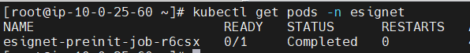

```
kubectl get configmap -n esignet
```


```
kubectl get secrets -n esignet
```
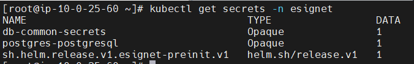

#### 5. Install eSignet dependent services:
eSignet dependent services are installed as specific HELM charts such as artifactory, softhsm, kafka, kafka-UI and keycloak.

##### 5.1 Artifactory
```
helm upgrade --install <artifactory_release_name> esignet-aws/artifactory -n artifactory --create-namespace
```
```
kubectl get pods -n artifactory
```
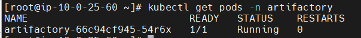

##### 5.2 Softhsm
```
helm upgrade --install <softhsm_release_name> mosip/softhsm -n softhsm --create-namespace
```
```
kubectl get pods -n softhsm
```


##### 5.3 Kafka & Kafka UI
```
helm upgrade --install <kafka_release_name> mosip/kafka -n kafka --create-namespace
helm upgrade --install <kafka_ui_release_name> mosip/kafka-ui -n kafka
```
```
kubectl get pods -n kafka
```


##### 5.4 Keycloak
| Property Name             | Value               | Description                                      |
|---------------------------|---------------------|--------------------------------------------------|
| alb.enabled               | TRUE                | Creates AWS load balancer if the field is 'true' |
| alb.name                  | esignet-alb         | AWS ALB name. Please mention the name you used in .env file in LOADBALANCER_NAME.                                  |
| alb.host                  | iam.sandbox.demodpgs.net | (Optional) Sub domain for keycloak service                  |
| alb.path                  | /auth               | Routing path for keycloak service                |
| alb.certificateArn        | ZZZZZZZZZZZ         | AWS Certificate ARN for the domain               |
| externalDatabase.host     | YYYYYYYY            | RDS/Data Host Address                            |
| externalDatabase.port     | 5432                | RDS/Data port number                             |
| externalDatabase.user     | postgres            | RDS/Data Username                                |
| externalDatabase.database | esignet_keycloak    | RDS/Data Database                                |
| externalDatabase.password | XXXXXXXX            | RDS/Data password                                |

```
helm upgrade --install <keycloak_release_name> esignet-aws/keycloak -n keycloak --create-namespace \
--set alb.enabled="true" \
--set alb.name="esignet-alb" \
--set alb.host="iam.sandbox.demodpgs.net" \
--set alb.path="/auth"  \
--set alb.certificateArn="arn:aws:acm:ap-south-1:1234567890:certificate/6064b56f-1367-4dc4-9a42-290bd724479a"  \
--set externalDatabase.host="YYYYYYYY" \
--set externalDatabase.port=5432 \
--set externalDatabase.user="postgres" \
--set externalDatabase.database="esignet_keycloak" \
--set externalDatabase.password="XXXXXXXX"
```

```
kubectl get pods -n keycloak
```
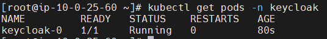

#### 6. Install eSignet initializations:
eSignet initializations are for executing some scripts to do specific task for dependent and esignet core service to ensure the seamless configurations.

##### 6.1 Postgres Init:
| Property Name                   | Value    | Description           |
|---------------------------------|----------|-----------------------|
| dbUserPasswords.dbuserPassword  | XXXXXXXX | RDS/Data password     |
| databases.mosip_esignet.enabled | TRUE     |                       |
| databases.mosip_esignet.rdsHost | YYYYYYYY | RDS/Data Host Address |
| databases.mosip_esignet.port    | 5432     | RDS/Data port number  |

```
helm upgrade --install <postgres_init_release_name> mosip/postgres-init -n esignet \
--set dbUserPasswords.dbuserPassword="XXXXXXXX"  \
--set databases.mosip_esignet.enabled="true" \
--set databases.mosip_esignet.rdsHost="YYYYYYYY" \
--set databases.mosip_esignet.port=5432
```

```
kubectl get pods -n esignet
```
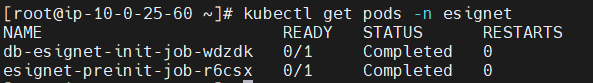

##### 6.2 Keycloak Init:
```
helm upgrade --install <keycloak_init_release_name> mosip/keycloak-init -n keycloak
```

```
kubectl get pods -n keycloak
```
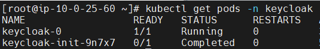

##### 6.3 eSignet Init:
| Property Name               | Value                                                 | Description           |
|-----------------------------|-------------------------------------------------------|-----------------------|
| image.envVars.DB_HOSTNAME   | YYYYYYYY                                              | RDS/Data Host Address |
| image.envVars.DB_USERNAME   | postgres                                              | RDS/Data Username     |
| image.envVars.DB_PASSWORD   | XXXXXXXX                                              | RDS/Data password     |
| image.envVars.DB_PORT       | 5432                                                  |                       |
| image.envVars.AWS_KAFKA_ARN | kafka-0.kafka-headless.${kafka.profile}:${kafka.port} | Kafka endpoint        |

```
helm upgrade --install <esignet_init_release_name> esignet-aws/esignet-init -n esignet \
--set image.envVars.DB_HOSTNAME="YYYYYYYY" \
--set image.envVars.DB_USERNAME="postgres" \
--set image.envVars.DB_PASSWORD="XXXXXXXX" \
--set image.envVars.DB_PORT="5432" \
--set image.envVars.AWS_KAFKA_ARN="kafka-0.kafka-headless.${kafka.profile}:${kafka.port}"
```

   ```
   kubectl get pods -n esignet
   ```
   
#### 7. Install eSignet core services:
```
   helm upgrade --install <esignet_release_name> esignet-aws/esignet -n esignet
   ```
  
   ```
   kubectl get pods -n esignet
   ```
   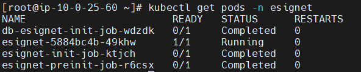

#### 8. Install OIDC UI:
| Property Name      | Value                   | Description                                      |
|--------------------|-------------------------|--------------------------------------------------|
| alb.enabled        | TRUE                    | Creates AWS load balancer if the field is 'true' |
| alb.name           | esignet-alb             | AWS ALB name. Please mention the name you used in .env file in LOADBALANCER_NAME                                   |
| alb.host           | esignet.sandbox.demodpgs.net | (Optional) Sub domain for esignet service                   |
| alb.path           | /                       | Routing path for esignet service                 |
| alb.certificateArn | ZZZZZZZZZZZZZZZ         | AWS Certificate ARN for the domain               |

```
helm upgrade --install <oidc_ui_release_name> esignet-aws/oidc-ui -n esignet \
--set alb.enabled="true" \
--set alb.name="esignet-alb" \
--set alb.host="esignet.sandbox.demodpgs.net" \
--set alb.path="/" \
--set alb.certificateArn="arn:aws:acm:ap-south-1:1234567890:certificate/6064b56f-1367-4dc4-9a42-290bd724479a"
```

   ```
   kubectl get pods -n esignet
   ```
   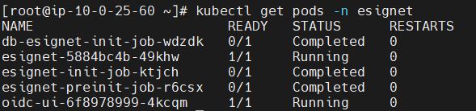

#### 9. After deployment, access the services and components as required.

Ensure all pods are running and check the service status in your specified namespace.

```
kubectl get pods -A --field-selector metadata.namespace!=kube-system
```
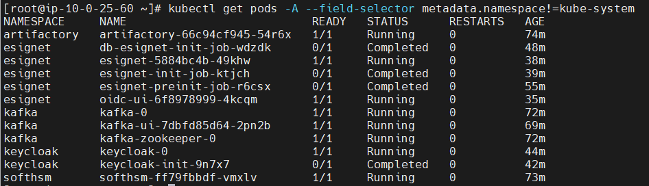

```
kubectl get deployments -A --field-selector metadata.namespace!=kube-system
```


```
kubectl get svc -n esignet
```


Retrieve the Amazon Application Load Balancer (ALB) DNS name by executing the commands below. 

```bash
kubectl get ingress -n esignet
```
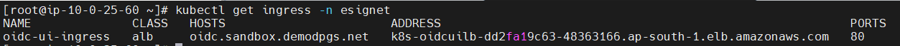

```bash
kubectl get ingress -n keycloak
```
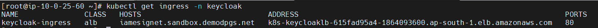

After running this command, you should see the ALB DNS name. Use this DNS name to access the Keycloak and OIDC portal.

Follow the post installation steps to start using eSignet services

* [Post Installation Procedure](03-Post-Installation-Procedure.md)

**Lastly, if you wish to clean up, run below two commands to remove all resources that were created by you.**
```
helm uninstall <release_name> -n <namespace>

kubectl delete ns <namespace>
```
