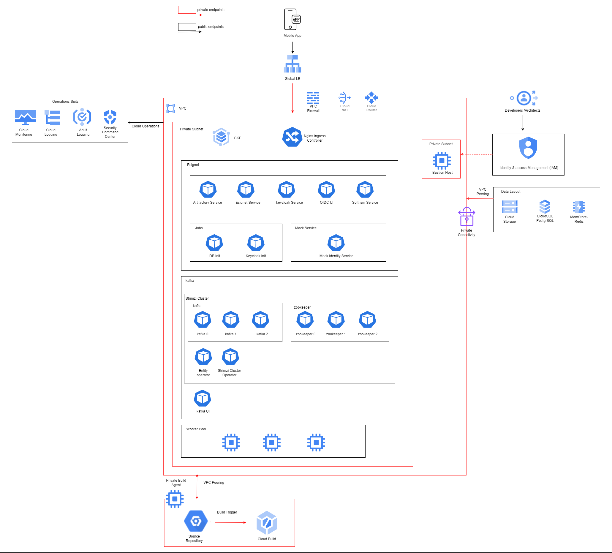
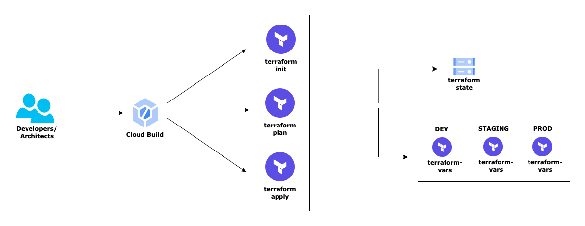

# eSignet, one-click deployment on GCP



## Introduction

## Deployment Approach

Deployment uses the following tools:

- **Terraform for GCP** - Infrastructure deployment
- **Helm chart** - Application/Microservices deployment
- **Cloud Build** - YAML scripts which acts as a wrapper around Terraform Deployment scripts

The entrie Terraform deployment is divided into 3 stages -

- **Pre-Config** stage
    - Create the required infra for RC deployment
- **Setup** Stage
    - Deploy the Core RC services

### Helm Chart Details
Currently, the below release version of the Helm charts will be deployed. The version can be updated in the [.env](.env) file if needed.

| Chart                      | Chart Version | Docker Image                 | Docker Version       |
|----------------------------|---------------|------------------------------|----------------------|
| mosip/softhsm              | 12.0.1        | mosipid/softhsm              | v2                   |
| mosip/artifactory          | 12.0.1        | mosipid/artifactory-server   | 1.4.1-ES             |
| mosip/keycloak             | 7.1.18        | mosipid/mosip-keycloak       | 16.1.1-debian-10-r85 |
| mosip/postgres-init        | 12.0.1        | mosipid/postgres-init        | 1.2.0.1              |
| mosip/esignet              | 1.4.1         | mosipid/esignet              | 1.4.1                |
| mosip/oidc-ui              | 1.4.1         | mosipid/oidc-ui              | 1.4.1                |
| mosip/keycloak-init        | 12.0.1        | mosipid/keycloak-init        | 1.2.0.1              |
| mosip/mock-identity-system | 0.9.3         | mosipid/mock-identity-system | 0.9.3                |
 
 **.env**
  - helm chart values which includes Docker Image,chart version,Docker Version, repository can be passed into the .env file and can be called dynamically while deploying.

### Pre-requisites

- #### [Install the gcloud CLI](https://cloud.google.com/sdk/docs/install)


- #### [Run gcloud commands with Cloud Shell](https://cloud.google.com/shell/docs/run-gcloud-commands)

- #### [**Install kubectl**]

  Link: https://cloud.google.com/kubernetes-engine/docs/how-to/cluster-access-for-kubectl#apt

  Follow the steps mentioned in the above link to install Kubectl


- #### [**Install Helm**]

  Link: https://helm.sh/docs/intro/install/
  
  Follow the steps mentioned in the above link to install helm

### Workspace - Folder structure

- **(***Root Folder***)**
    - **assets**
        - images
        - architetcure diagrams
        - ...(more)
    - **builds**
        - **apps** - Deploy/Remove all Application services
        - **infra** - Deploy/Remove all Infrastructure components end to end
    - **deployments -** Store config files required for deployment
        - **configs**
            - Store config files required for deployment
        - **scripts**
            - Shell scripts required to deploy services
    - **terraform-scripts**
        - Deployment files for end to end Infrastructure deployment
    - **terraform-variables**
        - **dev**
            - **pre-config**
                - **pre-config.tfvars**
                    - Actual values for the variable template defined in **variables.tf** to be passed to **pre-config.tf**


### Infrastructure Deployment



## Step-by-Step guide

#### Setup CLI environment variables

```bash
PROJECT_ID=
OWNER=
GSA=$PROJECT_ID-sa@$PROJECT_ID.iam.gserviceaccount.com
GSA_DISPLAY_NAME=$PROJECT_ID-sa
REGION=asia-south1
ZONE=asia-south1-a
CLUSTER=
DOMAIN_NAME=
EMAIL_ID=
ENABLE_MOCK=false # to enable deployment of mock ida 
alias k=kubectl
```

#### **script to setup authentication, configuring the project, enabling services, and creating a service account in GCP**:
```
script file located at `deployment/scripts/setup_gcp.sh` 

**To execute the script**
bash setup_gcp.sh
```

#### Deploy Infrastructure using Terraform

#### Teraform State management

```bash
# Maintains the Terraform state for deployment
gcloud storage buckets create gs://$PROJECT_ID-esignet-state --project=$PROJECT_ID --default-storage-class=STANDARD --location=$REGION --uniform-bucket-level-access

# List all Storage buckets in the project to check the creation of the new one
gcloud storage buckets list --project=$PROJECT_ID
```

#### Pre-Config

##### Prepare Landing Zone

```bash
cd $BASEFOLDERPATH

# One click of deployment of infrastructure
gcloud builds submit --config="./builds/infra/deploy-script.yaml" \
--project=$PROJECT_ID --substitutions=_PROJECT_ID_=$PROJECT_ID,\
_SERVICE_ACCOUNT_=$SERVICE_ACCOUNT,_LOG_BUCKET_=$PROJECT_ID-esignet-state

# Remove/Destroy infrastructure
/*
gcloud builds submit --config="./builds/infra/destroy-script.yaml" \
--project=$PROJECT_ID --substitutions=_PROJECT_ID_=$PROJECT_ID,\
_SERVICE_ACCOUNT_=$SERVICE_ACCOUNT,_LOG_BUCKET_=$PROJECT_ID-esignet-state
*/
```

##### Output
```
...
Apply complete! Resources: 36 added, 0 changed, 0 destroyed.

Outputs:

lb_public_ip = "**.93.6.**"
sql_private_ip = "**.125.196.**"
```

_**Before moving to the next step, you need to create domain/sub-domain and create a DNS `A` type record pointing to `lb_public_ip`**_


#### Deploy service

```bash
cd $BASEFOLDERPATH

# One click of deployment of services
#### The REGION,PROJECT_ID,GSA,EMAIL_ID,DOMAIN needs to be updated in the command below.

gcloud builds submit --config="./builds/apps/deploy-script.yaml" \
--region=$REGION --project=$PROJECT_ID --substitutions=_PROJECT_ID_=$PROJECT_ID,\
_REGION_="$REGION",_LOG_BUCKET_=$PROJECT_ID-esignet-state,_EMAIL_ID_=$EMAIL_ID,_DOMAIN_=$DOMAIN,_SERVICE_ACCOUNT_=$GSA,_ENABLE_MOCK_=$ENABLE_MOCK

# Remove/Destroy
#### The REGION,PROJECT_ID,GSA,EMAIL_ID,DOMAIN needs to be updated in the command below.

/*
gcloud builds submit --config="./builds/apps/destroy-script.yaml" \
--region=$REGION --project=$PROJECT_ID --substitutions=_PROJECT_ID_=$PROJECT_ID,\
_REGION_="$REGION",_LOG_BUCKET_=$PROJECT_ID-esignet-state,_SERVICE_ACCOUNT_=$GSA
*/
```

_**After successfully deploying the services you can check if you're able to access keycloak using your domain. Ex: https://$DOMAIN/auth/**_

_Please note that issuing of ssl certificate and DNS mapping might take some time_

_Only if you're able to access the keycloak UI, proceed to next steps_


## Connect to the Cluster through bastion host

```bash
gcloud compute instances list
gcloud compute ssh esignet-dev-ops-vm --zone=$ZONE
gcloud container clusters get-credentials esignet-dev-cluster --project=$PROJECT_ID --region=$REGION

kubectl get nodes
kubectl get pods -n esignet
kubectl get svc -n ingress-nginx
```


### Steps to connect to Psql
- Run the below command in bastion host
- Install psql client
```bash
sudo apt-get update
sudo apt-get install postgresql-client
```
- Run below command to access psql password
```bash
gcloud secrets versions access latest --secret esignet-dev
```
- Run below command to get private ip of sql
```bash
 gcloud sql instances describe esignet-dev-pgsql --format=json  | jq -r ".ipAddresses"
```
- Connect to psql
```bash
psql "sslmode=require hostaddr=PRIVATE_IP user=postgres dbname=postgres"
```


### Steps to access keycloak password
- Run the below command in bastion host
```bash
 echo Password: $(kubectl get secret --namespace esignet keycloak -o jsonpath="{.data.admin-password}" | base64 --decode)
```

### DEMO

The postman collection (along with env config) has been provided in `postman_collections` directory. 

Open postman and import both the collection and environment collections

- Select the `esignet-OIDC-flow-with-mock` environment from the dropdown
- Modify `host` environment variable to point to your specific domain
- Copy client secret of `mosip_pms_client` from keycloak UI or export the client secret by running below command
```bash
    kubectl get secrets keycloak-client-secrets -n esignet -o jsonpath="{.data.mosip_pms_client_secret}" | base64 --decode
```
- Modify `client_secret` environment variable with the above secret and save the changes

- You can now create a OIDC Client, goto `OIDC Client Mgmt` section and trigger all the APIs to create a OIDC client

- You can next create a mock identity to test OIDC flow for the user, goto `Mock-Identity-System` section and trigger `Create Mock Identity`

- Next you can test the OIDC flow for the identity created, goto `AuthCode Flow with OTP login` and trigger the APIs listed out in the same order.

- To Setup Global library **pmlib_code**

- Download the postman-util-lib from ```https://joolfe.github.io/postman-util-lib/#postman-collection``` and proceed following the steps mentioned in the Automatic Setup.
  
- Import the collection into your Postman App and execute GET request called 'Lib Install'.
  
- If the request returns 200 Success code then library will store a global variable called '''**pmlib_code**'''

## Steps to enable connection to MOSIP IDA

- Onboard your esignet instance as a provider in MOSIP IDA by connecting with MOSIP team.
- APIs to get certificates is available in the [postman collection](postman_collections)
- After on-boarding a MISP license key will be shared, that needs to be updated it in [.env](.env) file (misp_key)
- And the Certificate shared needs to be updated in esignet using an API which is available in the [postman collection](postman_collections)
- You need to also disable the MOCK_IDA deployment which can be turned off during the deployment phase by setting _ENABLE_MOCK_=false

## Steps to update esignet properties
To edit the esignet properties, run the below command.
```bash
kubectl edit configmap esignet-local-properties  -n esignet
```
After modifying the configmap, restart the esignet service.
```bash
kubectl rollout restart deploy esignet -n esignet
```
